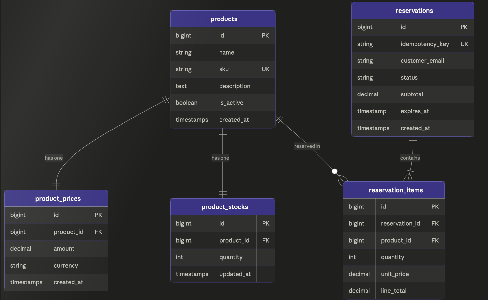

## Özellikler

- Ürün listeleme — arama, filtreleme, sıralama, sayfalama
- Sepet quote hesabı — fiyat manipülasyonu mümkün değil
- Idempotent rezervasyon oluşturma
- Rezervasyon release işlemi
- Aktif rezervasyonlardan türetilen kullanılabilir stok mantığı
- Eşzamanlı isteklere karşı `SELECT ... FOR UPDATE` ile kilitleme
- Seeder ile örnek katalog ve rezervasyon akış verisi
- Feature test kapsamı

## Postman Koleksiyonu

 Postman koleksiyonunu buradan indirebilir ve test edebilirsiniz :

[Postman Koleksiyonu - Forsit API ](./postman/Forsit_API_TR.postman_collection.json)

## Trade-off'lar ve Üretim Notları

**Fiziksel stok azaltma vs. sanal stok hesabı:**
Sanal stok hesabı (`quantity - reserved`) tercih edildi. Daha az yazma operasyonu, daha az deadlock riski. Dezavantajı: her stok sorgusunda JOIN gerekli.

**Expired rezervasyonlar:**
Şu an sorgu seviyesinde dışlanıyor. Üretimde bir `ExpireReservationsJob` ile `active → expired` geçişi scheduler'a bağlanabilir. Bu sayede raporlama ve temizlik işlemleri netleşir.


## Veri Modeli

Veritabani model gorseli:



```
products
  ├── product_prices   (hasMany)
  ├── product_stocks   (hasOne)
  └── reservation_items (hasMany)

reservations
  └── reservation_items (hasMany)
       └── product (belongsTo)
```

Tablolar:

| Tablo | Açıklama |
|---|---|
| `products` | Ürün kataloğu |
| `product_prices` | Fiyat geçmişi, fiyat her zaman DB'den okunur |
| `product_stocks` | Fiziksel stok miktarı |
| `reservations` | Rezervasyon kaydı, idempotency_key unique |
| `reservation_items` | Rezervasyon satırları, fiyat snapshot olarak saklanır |

---

## Stok Mantığı

Fiziksel stok rezervasyon anında azaltılmaz. Kullanılabilir stok şu formülle hesaplanır:

```
available_stock = product_stocks.quantity - SUM(aktif ve süresi dolmamış reservation_items.quantity)
```

Bu yaklaşımın avantajları:

- Süresi dolan rezervasyonlar fiziksel stoğu bozmaz
- Release işleminde stok geri yazma gerekmez
- Fiziksel stok ile rezervasyon stoğu birbirinden bağımsız kalır

---

## Eşzamanlılık ve Veri Tutarlılığı

Aynı anda birden fazla rezervasyon isteği geldiğinde stokun negatife düşmemesi için:

1. `product_stocks` satırları `SELECT ... FOR UPDATE` ile kilitlenir
2. `reservation_items` JOIN ile kilitlenir, `whereHas` içinde `lockForUpdate()` kullanılmaz
3. Tüm işlem tek bir `DB::transaction()` içinde yapılır, hata durumunda otomatik geri alınır
4. Transaction 3 kez retry eder (deadlock toleransı için)

---

## Idempotency

Aynı `idempotency_key` ile gelen ikinci istek yeni rezervasyon oluşturmaz, mevcut rezervasyonu döndürür.

İki katmanlı koruma:

- Transaction içinde `lockForUpdate()` ile mevcut kayıt sorgulanır
- Eğer race condition nedeniyle iki istek aynı anda geçerse MySQL `unique` constraint devreye girer, `QueryException` error code `1062` ile yakalanır

---

## Rezervasyon Durumları

`reservations.status` alanı `ReservationStatus` enum kullanır:

| Durum | Açıklama |
|---|---|
| `active` | Rezervasyon devam ediyor |
| `released` | Müşteri iptal etti |
| `expired` | Süre doldu, sorgu seviyesinde dışlanır |

---


### ReservationStatus Enum

```php
//rezervasyon kaydı status durumunu belirler
```

Bu yorum, `ReservationStatus` enumunun `reservations.status` alanının iş mantığını yönettiğini anlatır.

### ApiResponse Trait

```php
// standart response formatı için controllerde kullanabilecigim
// için trait tanımladım
```

Bu yorum, controller katmanında ortak JSON response formatı üretmek için `ApiResponse` traitinin kullanıldığını açıklar.

---

## Proje Yapısı

```
app/
├── Enums/
│   └── ReservationStatus.php
├── Http/
│   ├── Controllers/
│   │   ├── ProductController.php
│   │   ├── CartController.php
│   │   └── ReservationController.php
│   ├── Requests/
│   │   ├── ListProductsRequest.php
│   │   ├── CartQuoteRequest.php
│   │   └── CreateReservationRequest.php
│   └── Resources/
│       ├── ProductResource.php
│       └── ReservationResource.php
├── Models/
│   ├── Product.php
│   ├── ProductPrice.php
│   ├── ProductStock.php
│   ├── Reservation.php
│   └── ReservationItem.php
├── Services/
│   ├── Cart/CartService.php
│   ├── Product/ProductService.php
│   └── Reservation/ReservationService.php
└── Traits/
    └── ApiResponse.php
```

---

## API Endpointleri

### GET /api/products

Ürünleri listeler. Desteklenen parametreler:

| Parametre | Tip | Açıklama |
|---|---|---|
| `search` | string | İsim, SKU veya açıklamada arama |
| `is_active` | boolean | Aktif/pasif filtresi |
| `in_stock` | boolean | Stokta var/yok filtresi |
| `currency` | string (3 harf) | Para birimi filtresi |
| `min_price` | numeric | Minimum fiyat |
| `max_price` | numeric | Maksimum fiyat |
| `sort_by` | name\|sku\|created_at\|price\|stock | Sıralama alanı |
| `sort_direction` | asc\|desc | Sıralama yönü |
| `per_page` | integer (1-100) | Sayfa başı kayıt |
| `page` | integer | Sayfa numarası |

### POST /api/cart/quote

```json
{
  "items": [
    { "product_id": 1, "quantity": 2 },
    { "product_id": 2, "quantity": 1 }
  ]
}
```

### POST /api/reservations

```json
{
  "idempotency_key": "order-1001",
  "customer_email": "customer@example.com",
  "expires_at": "2026-05-06T15:00:00Z",
  "items": [
    { "product_id": 1, "quantity": 2 }
  ]
}
```

### POST /api/reservations/{reservation}/release

Body gerekmez. Sadece aktif rezervasyonlar release edilebilir.

---

## Response Formatı

### Başarı

```json
{
  "success": true,
  "message": "OK",
  "data": {},
  "meta": {}
}
```

### Hata

```json
{
  "success": false,
  "message": "Validation failed.",
  "errors": {
    "items": ["Insufficient stock."]
  },
  "error_code": "GENERAL_ERROR"
}
```

---

## Kurulum

### 1. Bağımlılıkları yükle

```bash
composer install
```

### 2. Ortam dosyasını hazırla

```bash
cp .env.example .env
php artisan key:generate
```

### 3. Veritabanı ayarlarını yap

```env
DB_CONNECTION=mysql
DB_HOST=127.0.0.1
DB_PORT=3306
DB_DATABASE=forsit
DB_USERNAME=root
DB_PASSWORD=secret
```

### 4. Migration çalıştır

```bash
php artisan migrate
```

### 5. Seed verisini yükle

```bash
php artisan db:seed
```

---

## Seeder İçeriği

| Seeder | İçerik |
|---|---|
| `ProductCatalogSeeder` | Örnek ürünler, fiyatlar, stoklar |
| `ReservationFlowSeeder` | Aktif, released ve expired rezervasyon senaryoları |

---

## Testler

```bash
# Tüm testler
php artisan test

# Tek dosya
php artisan test tests/Feature/ProductListTest.php
php artisan test tests/Feature/CartQuoteTest.php
php artisan test tests/Feature/ReservationCreateTest.php
php artisan test tests/Feature/ReservationReleaseTest.php
```

Test kapsamı:

| Dosya | Kapsam |
|---|---|
| `ProductListTest` | Listeleme, arama, filtreleme, sayfalama |
| `CartQuoteTest` | Başarılı quote, pasif ürün, yetersiz stok |
| `ReservationCreateTest` | Oluşturma, idempotency, eşzamanlılık |
| `ReservationReleaseTest` | Release, çift release koruması, expired kontrolü |

---

## Kod Kalitesi

```bash
vendor/bin/pint
php -l app/Services/Reservation/ReservationService.php
```

---

## Önemli Değerlendirmeler

### Mevcut stok nasıl hesaplanırr?

Bu projede kullanılabilir stok fiziksel stoktan türetilir. Fiziksel stok `product_stocks.quantity` alanında tutulur. Kullanılabilir stok ise `CartService` ve `ReservationService` içinde şu mantıkla hesaplanır:

```text
available_stock = physical_stock - active_and_unexpired_reserved_quantity
```

Buradaki `active_and_unexpired_reserved_quantity` değeri:

- `reservation_items`
- `reservations.status = active`
- `reservations.expires_at > now()`

koşullarıyla toplanır.

Bu yüzden rezervasyon oluşturulurken fiziksel stok azaltılmaz. Release işleminde de fiziksel stoğa geri yazım yapılmaz.

### Performans sorunlarından nasıl kaçınılır?

Kodda N+1 sorgu problemini azaltmak için eager loading kullanılır:

- `ProductService` içinde ürünler `latestPrice` ve `stock` ilişkileriyle birlikte yüklenir
- `CartService` içinde ürünler toplu olarak `whereIn(...)->with(['latestPrice', 'stock'])` ile çekilir
- `ReservationService` içinde rezervasyon dönüşlerinde `items.product.latestPrice` ve `items.product.stock` birlikte yüklenir

Ayrıca stok hesabı ürün başına tek tek sorgu atılarak değil, toplu `SUM(quantity)` sorguları ile yapılır.

Not:

- `ProductService` içindeki `in_stock` filtresi şu anda fiziksel stok üzerinden çalışıyor
- gerçek kullanılabilir stok mantığı ise `CartService` ve `ReservationService` tarafında rezervasyonları da düşerek hesaplanabilirr

Yani listeleme filtresi ile rezervasyon akışındaki gerçek availability kontrolü birebir aynı değil. Üretimde bu iki taraf ortak bir availability query katmanında birleştirilebilir.

### Eşzamanlı istekler altında stok tutarsızlıklarını nasıl önlersiniz?

`ReservationService::create()` içinde kritik bölüm transaction altında çalışır.

Koruma adımları::

1. Aynı ürünlerin `product_stocks` satırları `lockForUpdate()` ile kilitlenir
2. Aynı ürünlere ait aktif rezervasyon satırları `reservation_items JOIN reservations` sorgusu üzerinden `lockForUpdate()` ile kilitlenir
3. Kullanılabilir stok, bu kilitli veriler üzerinden yeniden hesaplanır
4. Ancak yeterli stok varsa yeni `reservation_items` kayıtları yazılır

Bu sayede iki istek aynı anda gelip aynı ürünü rezerve etmeye çalışsa bile, ikinci istek ilk transaction tamamlanmadan net availability hesabına geçemez.

### Stokun hiçbir zaman negatife düşmemesini nasıl sağlarsınız?

Bu projede stok negatif düşmez çünkü:

- fiziksel stok azaltılmaz
- rezervasyon oluşturma anında `availableQuantity < requestedQuantity` kontrolü yapılır
- bu kontrol transaction içindeki kilitli sorgularla tekrar doğrulanır

Yani negatif stok koruması uygulama seviyesinde sadece ilk quote aşamasında değil, asıl yazma işleminden hemen önce ikinci kez yapılır.

### İşlemsel bütünlüğü nasıl ele alırsınız?

`ReservationService` içinde hem `create()` hem `release()` işlemleri `DB::transaction()` ile çalışır.

Bu ne sağlar:

- rezervasyon üst kaydı ve satırları yarım oluşmaz
- hata olursa tüm işlem geri alınır
- kilitli sorgular aynı transaction bağlamında çalışır
- Laravel transaction retry sayısı `3` olarak verilmiştir

Özellikle `create()` için bu kritik, çünkü:

- idempotency kontrolü
- stok kilidi
- reserved quantity hesabı
- reservation oluşturma
- reservation item ekleme
- subtotal güncelleme

tek atomik akış içinde tamamlanır.

### Bu senaryoda tekrarlanabilirliği nasıl uygularsınız?

Bu projede tekrarlanabilirlik `idempotency_key` ile uygulanır.

Akış:

1. İstek `idempotency_key` ile gelir
2. `ReservationService::create()` içinde önce aynı key ile mevcut rezervasyon `lockForUpdate()` kullanılarak aranır
3. Kayıt varsa yeni rezervasyon oluşturulmaz, mevcut kayıt döndürülür
4. Çok dar bir yarış durumunda iki istek aynı anda geçerse veritabanındaki unique constraint devreye girer
5. Bu durumda MySQL duplicate key hatası `1062` olarak yakalanır ve yine mevcut rezervasyon geri döndürülür

Bu yapı sayesinde:

- istemci aynı isteği güvenle tekrar gönderebilir
- network retry senaryolarında duplicate reservation oluşmaz
- idempotency sadece uygulama mantığına değil, veritabanı unique constraint’ine de dayanırrr

